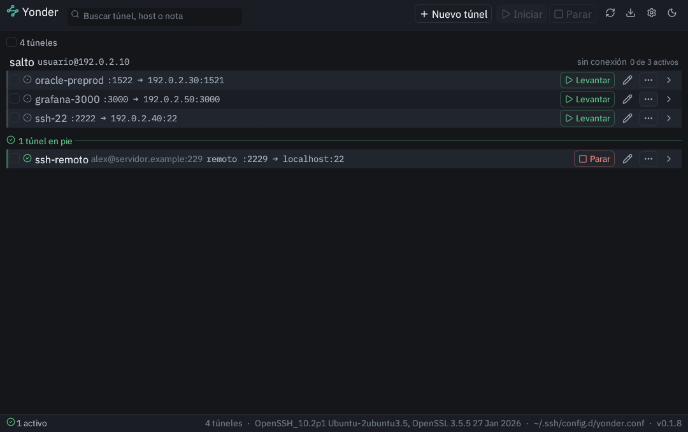
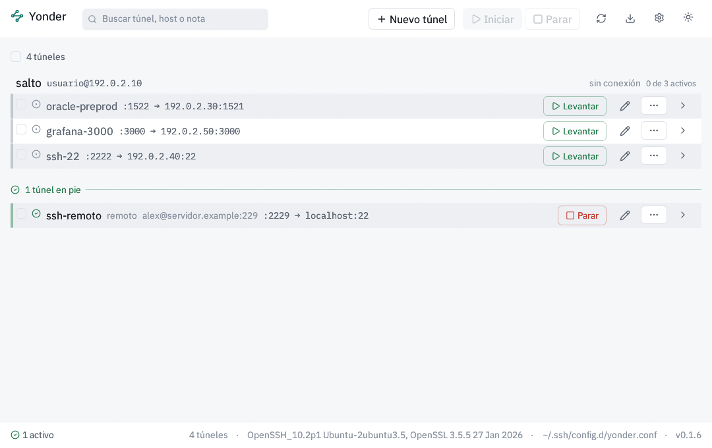

# yonder

Gestor gráfico y de línea de órdenes de túneles SSH para Linux. Define, activa
y supervisa reenvíos de puertos sobre OpenSSH, y detecta los túneles que han
dejado de transportar tráfico aunque la conexión siga establecida.

Se distribuye tal cual, bajo licencia MIT, sin compromiso de soporte.



<details>
<summary>La misma lista en tema claro</summary>


</details>

## Índice

1. [Alcance](#1-alcance)
2. [Modelo de almacenamiento](#2-modelo-de-almacenamiento)
3. [Instalación](#3-instalación)
4. [Uso](#4-uso)
5. [Estados y comprobaciones de salud](#5-estados-y-comprobaciones-de-salud)
6. [Persistencia de los procesos](#6-persistencia-de-los-procesos)
7. [Modelo de amenazas](#7-modelo-de-amenazas)
8. [Ubicación de los datos](#8-ubicación-de-los-datos)
9. [Fuera de alcance](#9-fuera-de-alcance)
10. [Desarrollo](#10-desarrollo)
11. [Licencia](#11-licencia)

---

## 1. Alcance

### 1.1 Funciones

- Reenvío local simple: un puerto de la máquina propia hacia un destino
  accesible desde el servidor remoto.
- Reenvío a través de máquina de salto, con uno o varios saltos.
- Túneles persistentes con reconexión automática, y túneles efímeros bajo
  demanda.
- Panel de estado que refleja la situación real de cada reenvío y detecta la
  caída de un túnel aunque la conexión no la acuse, incluido el supuesto en que
  el puerto local permanece abierto sin transportar tráfico.
- Supervisión periódica sin la ventana abierta, de activación opcional.

### 1.2 Delimitación

La aplicación no reimplementa SSH (Secure Shell). El binario `ssh` del sistema
actúa como motor, y esta herramienta se limita a orquestarlo y a presentar su
estado. De esa delegación se derivan sin coste adicional el salto multisalto
mediante `ProxyJump`, la verificación por `known_hosts`, el uso de `ssh-agent`,
las claves FIDO2 y PKCS#11, la autenticación GSSAPI y el conjunto de algoritmos
que mantiene el paquete de la distribución.

---

## 2. Modelo de almacenamiento

Los túneles no se almacenan en una base de datos propia, sino en un fichero de
configuración de OpenSSH:

```
~/.ssh/config.d/yonder.conf
```

incluido desde `~/.ssh/config` mediante una directiva que la aplicación añade
la primera vez, previa copia de seguridad del fichero original:

```
Include ~/.ssh/config.d/yonder.conf
```

Una entrada característica:

```
Host tunel-preprod
    HostName <servidor-interno>
    User <usuario>
    ProxyJump <salto>
    LocalForward 3000 localhost:3000
    ExitOnForwardFailure yes
    ServerAliveInterval 15
    ServerAliveCountMax 3
```

La consecuencia operativa es que todo túnel definido de este modo queda
disponible para `ssh`, `scp`, `rsync`, VS Code Remote y cualquier otro cliente,
sin necesidad de que la aplicación esté en ejecución. Almacenarlos en una base
de datos propia habría duplicado un formato ya existente y habría aislado la
herramienta del resto del instrumental.

La aplicación es propietaria exclusiva de `yonder.conf` y preserva su contenido:
al reescribirlo conserva los comentarios, el orden de las entradas y las
directivas que no interpreta. El fichero `~/.ssh/config` no se reescribe en
ningún caso, salvo para incorporar la directiva `Include` la primera vez.

---

## 3. Instalación

Cada publicación incluye un paquete `.deb`, un paquete `.rpm` y un archivo
comprimido.

### 3.1 Debian, Ubuntu y derivadas

```bash
sudo apt install ./yonder_*_amd64.deb
```

### 3.2 Fedora, RHEL y openSUSE

```bash
sudo dnf install ./yonder-*.rpm
```

Ambos paquetes instalan los ejecutables `yonder` y `yonder-askpass` en
`/usr/bin`, registran la entrada correspondiente en el menú de aplicaciones y
depositan el ejemplo de configuración en `/usr/share/doc/yonder/`.

### 3.3 Otras distribuciones

Las bibliotecas gráficas deben encontrarse ya instaladas en el sistema.

```bash
tar xzf yonder-linux-x86_64.tar.gz
install -m 755 yonder yonder-askpass ~/.local/bin/
```

Ambos ejecutables han de residir en el mismo directorio: el principal localiza a
`yonder-askpass` junto a sí mismo y, en su defecto, a través de la variable
`PATH`.

### 3.4 Dependencias declaradas manualmente

La herramienta `ldd` aplicada al ejecutable solo revela `libc`, `libm` y
`libgcc_s`. Las bibliotecas gráficas —`libGL`, `libX11`, `libwayland-*` y
`libxkbcommon*`— se cargan mediante `dlopen` en tiempo de ejecución y no figuran
en la tabla de enlazado. Un paquete que se basara únicamente en `ldd` se
instalaría sin incidencias en un sistema incapaz de abrir la ventana. Por ese
motivo dichas dependencias se declaran de forma explícita.

### 3.5 Compilación a partir del código fuente

Se requieren Rust, un ejecutable `ssh` accesible desde `PATH` y las bibliotecas
de desarrollo de X11 o Wayland.

```bash
cargo build --release

empaquetado/construir-deb.sh     # genera el .deb en dist/
empaquetado/construir-rpm.sh     # genera el .rpm; requiere el paquete «rpm»
pruebas/paquete.sh dist/*.deb    # instala en una raíz temporal y verifica
```

El empaquetado consiste en tres guiones de shell sobre `dpkg-deb` y `rpmbuild`.
Se prescinde de `cargo-deb` y `cargo-generate-rpm` para no incorporar dos
dependencias de compilación adicionales destinadas a producir lo que las
herramientas de la propia distribución ya generan.

---

## 4. Uso

### 4.1 Interfaz gráfica

```bash
yonder          # abre la ventana si existe servidor gráfico
yonder gui      # la abre en todo caso
```

### 4.2 Cómo se organiza la lista

**Los reenvíos se agrupan por el host que los sostiene.** OpenSSH abre una sola
conexión maestra por host y cuelga de ella todos sus reenvíos; la lista refleja
esa jerarquía. El alias, el usuario y el destino aparecen una vez, en la
cabecera del grupo, junto al recuento de cuántos de sus reenvíos están en pie.
Un host con un único reenvío no lleva cabecera: se indica su alias en la propia
fila.

**Cada reenvío ocupa una línea**, encabezada por su nombre. Los extremos se
abrevian a su forma mínima discriminante:

```
:1522 → 192.0.2.30:1521      la dirección local se omite: es 127.0.0.1 en todas
0.0.0.0:8080 → interno:80    salvo cuando NO es el bucle local, que sí importa
:1080 → SOCKS                reenvío dinámico
```

**La pantalla se divide en dos.** Los túneles en pie ocupan la mitad inferior,
separados por una línea con su recuento; el resto queda arriba. Responden a
preguntas distintas —lo que está arriba se vigila, lo que está en reposo se
busca para arrancarlo— y separarlos evita tener que leer el estado de cada fila
para saber en cuál de las dos situaciones se está.

Un host cuyos reenvíos estén en ambos estados aparece en las dos mitades, cada
una con su propio recuento.

### 4.3 El nombre de un reenvío

El nombre es lo que encabeza la fila y lo único que distingue un reenvío de sus
vecinos, que comparten alias y destino. Se define en el campo **Nombre** del
formulario y se guarda como un comentario delante de su directiva:

```
Host salto
    HostName 192.0.2.10
    # nombre: oracle-preprod
    LocalForward 1522 192.0.2.30:1521
    # nombre: api-health
    # salud: http:/api/health
    LocalForward 3000 192.0.2.50:3000
```

OpenSSH ignora la línea por tratarse de un comentario, de modo que la definición
sigue residiendo en un único fichero.

Cuando no se indica ninguno, se deriva del destino: `oracle-1521`,
`grafana-3000`, `ssh-22`. Para un puerto sin servicio reconocido se emplea
`puerto-9418`, que informa de lo que se sabe sin inventar lo que no.

### 4.4 Tamaño de la interfaz

Se ajusta con el contador de **Ajustes**, en pasos del 5 % entre el 80 % y el
200 %, o con los atajos habituales:

| Atajo | Efecto |
|---|---|
| `Ctrl` `+` | Aumentar |
| `Ctrl` `-` | Reducir |
| `Ctrl` `0` | Volver al 100 % |

El valor se guarda en las preferencias y se conserva entre sesiones. El techo
del 200 % responde a la pauta 1.4.4 de las WCAG, que exige poder ampliar el
texto al doble sin que la maquetación se rompa.

La barra inferior muestra la versión en ejecución, junto al recuento de túneles
y la ruta del fichero de configuración.

### 4.5 Parámetros del formulario «Nuevo túnel»

El formulario se compone de dos partes: los datos de la conexión, comunes a
todos sus reenvíos, y una fila por cada puerto reenviado. Bajo cada fila se
muestra la línea exacta que se escribirá en el fichero, de modo que el
resultado es visible antes de guardar.

#### 4.5.1 Datos de la conexión

| Campo | Obligatorio | Directiva | Descripción |
|---|---|---|---|
| **Alias** | Sí | `Host` | Nombre con el que se invoca la conexión, incluido `ssh <alias>` desde la terminal. No admite espacios ni los comodines `*`, `?` y `!`: designa un host concreto, no un patrón |
| **Host de destino** | Sí | `HostName` | Nombre o dirección del servidor SSH. Puede omitirse únicamente si el propio alias resuelve por DNS o por otra entrada de `~/.ssh/config` |
| **Usuario** | No | `User` | Cuenta remota. En blanco se aplica lo que determine OpenSSH: el usuario local o el declarado en la configuración |
| **Puerto SSH** | No | `Port` | Puerto del servidor SSH. En blanco, 22 |
| **Máquinas de salto** | No | `ProxyJump` | Uno o varios saltos intermedios, separados por comas. OpenSSH los encadena en el orden indicado |
| **Clave privada** | No | `IdentityFile` | Ruta de la clave. En blanco la elección corresponde a `ssh-agent`. Una clave respaldada por hardware (sufijo `_sk`) exigirá interactuar con el dispositivo físico |
| **Nota** | No | comentario `# nota:` | Texto libre que se muestra bajo el túnel en la lista. OpenSSH lo ignora por tratarse de un comentario |

#### 4.5.2 Reenvíos

Se admite más de un reenvío por conexión, y todos comparten la misma conexión
maestra. Debe declararse al menos uno.

| Campo | Obligatorio | Descripción |
|---|---|---|
| **Tipo** | Sí | `Local` (`LocalForward`, equivalente a `-L`) abre un puerto en la máquina propia hacia un destino accesible desde el servidor remoto. `Remoto` (`RemoteForward`, `-R`) hace lo inverso: abre el puerto en el servidor remoto hacia un destino accesible desde aquí. `SOCKS` (`DynamicForward`, `-D`) abre un proxy dinámico y no requiere destino |
| **Escucha en** | No | Interfaz en la que se abre el puerto. En blanco, `localhost`, de modo que solo es accesible desde la propia máquina. Indicar una dirección que abarque todas las interfaces expone el puerto al resto de la red, y el formulario lo advierte |
| **Puerto local** | Sí | Puerto que se abre. Los inferiores a 1024 requieren la capacidad descrita en el apartado 4.7 |
| **Host remoto** | Sí, salvo en `SOCKS` | Destino del reenvío, resuelto **desde el servidor remoto**. El valor predeterminado es `localhost`, que designa al propio servidor y no a la máquina de origen |
| **Puerto remoto** | Sí, salvo en `SOCKS` | Puerto del destino |
| **Comprobación** | No | Procedimiento de verificación de salud, disponible solo en los reenvíos locales. Las opciones se detallan en el apartado 5.2 |

La comprobación no se ofrece en los otros dos tipos por una razón de fondo: un
reenvío remoto abre el puerto en el extremo contrario, donde no hay nada que
sondear desde aquí, y un proxy SOCKS no responde a peticiones HTTP ni emite
saludo alguno, por lo que cualquier sonda de ese tipo lo marcaría
permanentemente como inoperativo.

#### 4.5.3 Validaciones y advertencias

Impiden guardar:

- Alias vacío, con espacios o con comodines.
- Ausencia de `HostName` cuando el alias no resuelve por sí mismo.
- Puerto igual a 0 o no numérico.
- Ningún reenvío declarado.
- Dos reenvíos escuchando en el mismo puerto local.

No impiden guardar, pero se advierten en el momento de definirlos y no cuando
falle la conexión:

- Puerto local inferior a 1024 sin la capacidad `CAP_NET_BIND_SERVICE`. Se
  indica la orden exacta que debe ejecutarse.
- Puerto local ya ocupado, identificando el proceso que lo retiene.
- Reenvío que escucha en todas las interfaces y queda por tanto accesible desde
  la red.

### 4.6 Interfaz de línea de órdenes

La totalidad de las operaciones disponibles en la ventana puede ejecutarse sin
ella:

| Orden | Función |
|---|---|
| `yonder list` | Relación de túneles y su estado |
| `yonder up <alias>` | Activa un túnel, o todos los de un alias |
| `yonder down <alias>` | Desactiva el túnel indicado |
| `yonder status` | Resumen de conexiones maestras y comprobaciones |
| `yonder import` | Muestra los túneles ya presentes en `~/.ssh/config` |
| `yonder import --todos` | Los incorpora además a la lista |
| `yonder supervise` | Ejecuta una pasada de reconciliación |
| `yonder supervise --simular` | Indica las acciones sin llevarlas a cabo |
| `yonder service install` | Instala el temporizador de systemd |
| `yonder service status` | Informa de si el temporizador está activo |
| `yonder hostkey <host>` | Verifica la clave del host y la añade a `known_hosts` |
| `yonder copyid <alias>` | Instala la clave pública mediante `ssh-copy-id` |
| `yonder clean` | Retira los sockets de control huérfanos |
| `yonder paths` | Indica la ubicación de cada elemento |

La salida se emite sin colores, con los prefijos `[ERR]`, `[WARN]`, `[INFO]` y
`[DEBUG]`.

### 4.7 Puertos inferiores a 1024

Su reenvío requiere una capacidad que el ejecutable no incorpora de serie. La
aplicación lo detecta durante la validación del túnel e indica la orden que debe
ejecutarse:

```bash
sudo setcap 'cap_net_bind_service=+ep' <ruta>/yonder
```

---

## 5. Estados y comprobaciones de salud

### 5.1 Estados

El estado se mantiene por túnel y no por host, dado que un mismo host puede
albergar varios reenvíos, cada uno susceptible de caer por separado.

| Estado | Significado |
|---|---|
| `Definido` | Existe en la configuración, sin conexión activa |
| `Conectando` | Conexión maestra en proceso de establecimiento o autenticación |
| `Activo` | Conexión maestra establecida y reenvío confirmado |
| `Degradado` | Conexión maestra establecida, pero el túnel no responde |
| `Reintentando` | A la espera del siguiente intento |
| `Fallido` | Reintentos agotados o error no recuperable |

El estado `Degradado` es el que distingue a la herramienta: un indicador en
verde mientras el túnel está inoperativo constituye una información
peligrosamente falsa.

### 5.2 El túnel inoperativo

Verificar que el puerto local se encuentra a la escucha resulta insuficiente.
El caso límite se produce cuando `ssh` acepta el reenvío y el puerto local
queda abierto, pero en el extremo remoto no hay ningún servicio atendiendo.
Ocurre cuando el destino del reenvío no coincide con la dirección en la que el
servicio remoto escucha efectivamente: por ejemplo, `localhost` en lugar del
alias de IP concreto al que se ha enlazado un contenedor. OpenSSH carece de
medios para advertirlo y da la operación por válida.

Por ese motivo cada túnel puede declarar el procedimiento de verificación
mediante un comentario que OpenSSH ignora:

```
    # salud: banner
    LocalForward 1522 192.0.2.30:1521

    # salud: http:/api/health
    LocalForward 3000 192.0.2.50:3000
```

| Comprobación | Procedimiento |
|---|---|
| *(ninguna)* | Verifica únicamente que el puerto local esté abierto. Es la predeterminada |
| `tcp` | Establece una conexión a través del túnel y la cierra |
| `banner` | Espera el saludo del servidor, como emiten SSH y Oracle Database |
| `http:/ruta` | Emite una petición HTTP y admite cualquier respuesta que no sea de error |

Las tres últimas atraviesan efectivamente el túnel, por lo que resultan
perceptibles en el extremo remoto. Su periodicidad predeterminada es de 30
segundos, configurable desde los ajustes. La comprobación de puerto abierto,
de coste despreciable, se mantiene con periodicidad de un segundo.

### 5.3 Recuperación

Cuando un túnel pasa a `Degradado`, la reparación se escala progresivamente:
primero se rehace el reenvío mediante `-O forward`, operación de bajo coste que
no exige reautenticación; si dos intentos consecutivos resultan insuficientes,
se cierra la conexión maestra y se restablece con la totalidad de sus túneles.

La reconexión no emplea `autossh`. Se apoya en las directivas
`ServerAliveInterval` y `ServerAliveCountMax` de OpenSSH, complementadas con
supervisión propia y retardo exponencial: 2 segundos de base, 60 segundos de
techo y una variación aleatoria de ±20 %, destinada a evitar que un conjunto
numeroso de túneles caídos simultáneamente —por ejemplo, al interrumpirse una
VPN (red privada virtual)— se restablezca en el mismo instante.

En [`docs/ejemplo.conf`](docs/ejemplo.conf) figura un ejemplo completo con siete
reenvíos a través de una misma máquina de salto y sus respectivas
comprobaciones.

---

## 6. Persistencia de los procesos

Las conexiones maestras se lanzan desprendidas del proceso principal y
sobreviven al cierre de la ventana. Al reabrirla, la aplicación explora los
sockets de control y reconstruye la vista a partir de las conexiones que
encuentra activas.

Los sockets que no responden se consideran huérfanos y se eliminan. Sin esa
depuración la lista acabaría reflejando un estado inexistente, situación menos
deseable que la ausencia de lista.

En consecuencia, la aplicación no incorpora icono en el área de notificación:
no requiere ningún proceso residente.

### 6.1 Supervisión con la ventana cerrada

```bash
yonder service install       # escribe las unidades de usuario y las activa
loginctl enable-linger $USER # mantiene la ejecución con la sesión cerrada
```

Se instala así un temporizador que ejecuta `yonder supervise` cada dos minutos.
No se introduce ningún proceso residente: `supervise` realiza una pasada de
reconciliación que compara el estado deseado con el observado, actúa en
consecuencia y finaliza. La operación es idempotente, por lo que el número de
ejecuciones resulta indiferente.

La unidad incorpora la directiva `KillMode=process` por un motivo concreto: las
conexiones maestras son procesos hijos lanzados con `ssh -f` que deben
sobrevivir a la finalización de la pasada, y el modo predeterminado llevaría a
systemd a terminar el grupo de control completo.

---

## 7. Modelo de amenazas

La aplicación no almacena claves privadas: delega su custodia en `ssh-agent`.
Las contraseñas de host, cuando existen, se depositan en el Secret Service del
sistema. Debe tenerse presente que un llavero desbloqueado es legible por esta
aplicación.

- **No se define una contraseña maestra propia.** GNOME Keyring y KWallet se
  desbloquean con la sesión; añadir una segunda barrera protegería el mismo
  material a costa de duplicar la solicitud.
- **En el escenario habitual no se almacena ningún secreto.** Con autenticación
  por clave pública, la frase de paso queda bajo custodia de `ssh-agent`.
- **No se emplea `StrictHostKeyChecking=no` en ningún caso.** La primera
  conexión recupera la clave del host, presenta su huella SHA-256 y aguarda
  confirmación expresa. La aceptación automática expondría la conexión a un
  ataque de intermediario precisamente en el momento crítico.
- **Las contraseñas se transmiten por socket Unix.** El ejecutable auxiliar
  `yonder-askpass` recibe la solicitud de `ssh`, la traslada a la ventana a
  través de un socket con permisos 0600 alojado en un directorio 0700 bajo
  `$XDG_RUNTIME_DIR`, y devuelve la respuesta. En ningún momento se escribe en
  disco.
- **La base de datos local almacena exclusivamente estado de ejecución:** orden
  de presentación, marca de arranque automático, última conexión correcta,
  contador de fallos y estadísticas. No contiene credenciales.
- **Claves respaldadas por hardware.** El uso de claves generadas con
  `ssh-keygen -t ed25519-sk` se detecta y se advierte de la necesidad de
  interactuar con el dispositivo físico. La funcionalidad la aporta `ssh`.

---

## 8. Ubicación de los datos

Las rutas se derivan de la especificación XDG Base Directory. No existe ninguna
ruta codificada en el programa.

| Contenido | Ruta |
|---|---|
| Definición de túneles | `~/.ssh/config.d/yonder.conf` |
| Preferencias | `$XDG_CONFIG_HOME/yonder/config.toml` |
| Estado de ejecución | `$XDG_DATA_HOME/yonder/estado.db` |
| Sockets de control | `$XDG_RUNTIME_DIR/yonder/ctl-<hash>` |
| Socket del askpass | `$XDG_RUNTIME_DIR/yonder/askpass.sock` |
| Registro de actividad | `$XDG_STATE_HOME/yonder/yonder.log` |

La orden `yonder paths` muestra las rutas efectivas en cada sistema.

Cuando `$XDG_RUNTIME_DIR` corresponde a una ruta excesivamente profunda, los
sockets se crean en el directorio temporal: la estructura `sockaddr_un` impone
un límite de 108 bytes cuya superación provoca un fallo de `ssh` sin diagnóstico
interpretable.

---

## 9. Fuera de alcance

Las siguientes funcionalidades quedan excluidas de forma deliberada:

- Icono en el área de notificación del escritorio.
- Internacionalización.
- Sistema de extensiones.
- Repositorios propios (PPA, COPR, OBS) y presencia en los repositorios
  oficiales de las distribuciones. Se publican un `.deb` y un `.rpm` en cada
  versión porque los genera la misma integración continua a partir del mismo
  ejecutable; mantener una matriz de distribuciones tiene un coste distinto.
- Sincronización en la nube.
- Terminal integrada.
- Interfaz gráfica para reenvíos remotos y SOCKS. El modelo de datos los
  contempla y la línea de órdenes los gestiona, pero el editor gráfico de esta
  versión se limita a los reenvíos locales.
- Gestión de perfiles y funcionamiento multiusuario.

---

## 10. Desarrollo

```bash
cargo test                   # pruebas unitarias
cargo build --release
pruebas/e2e-aislado.sh       # túnel real contra un servidor SSH de pruebas
```

La prueba de extremo a extremo levanta un servidor `sshd` propio en un puerto
alto y un servicio HTTP de destino, y verifica sobre un túnel real el
cumplimiento de los criterios de aceptación: que el tráfico atraviesa el túnel,
que `ssh <alias>` opera desde la terminal sin la aplicación, que la terminación
externa de la conexión maestra se detecta y se recupera, que un reenvío caído
con la conexión maestra activa se refleja como `Degradado`, y que un puerto
ocupado produce un error que identifica al ocupante e indica la acción
procedente.

La prueba reproduce asimismo el supuesto descrito en el apartado 5.2: un
reenvío dirigido a un destino sin servicio, que deja el puerto local abierto sin
transportar tráfico. La comprobación de puerto abierto lo daría por válido; la
sonda de salud lo clasifica como `Degradado`.

La ejecución transcurre dentro de `bwrap`, con el directorio de inicio
sustituido. La precaución es necesaria: `ssh` expande la virgulilla de
`~/.ssh/config` mediante la entrada de `passwd` y no mediante la variable
`HOME`, de modo que sin un montaje efectivo la prueba escribiría sobre la
configuración SSH real. En ausencia de `bwrap` la prueba se omite con un aviso.

La integración continua consta de tres flujos. `pruebas.yml` ejecuta el
formato, `clippy`, las pruebas unitarias y la de extremo a extremo en cada
empujón a `main` y en cada *pull request*; `release.yml` invoca ese mismo flujo
al etiquetar una versión y, superado, construye y publica los paquetes;
`auditoria.yml` revisa semanalmente los avisos de seguridad de las dependencias
(`cargo audit`) y comprueba que el `rust-version` declarado en `Cargo.toml`
sigue compilando el árbol completo. La auditoría corre aparte con deliberación:
su fallo señala que hay que revisar dependencias, no que un cambio concreto
haya roto nada.

Los iconos constituyen un subconjunto de [Lucide](https://lucide.dev), embebido
en el ejecutable. Su regeneración se efectúa mediante:

```bash
scripts/extraer-iconos.sh
```

---

## 11. Licencia

MIT. Véase [LICENSE](LICENSE).

Los iconos proceden de Lucide, bajo licencia ISC.
